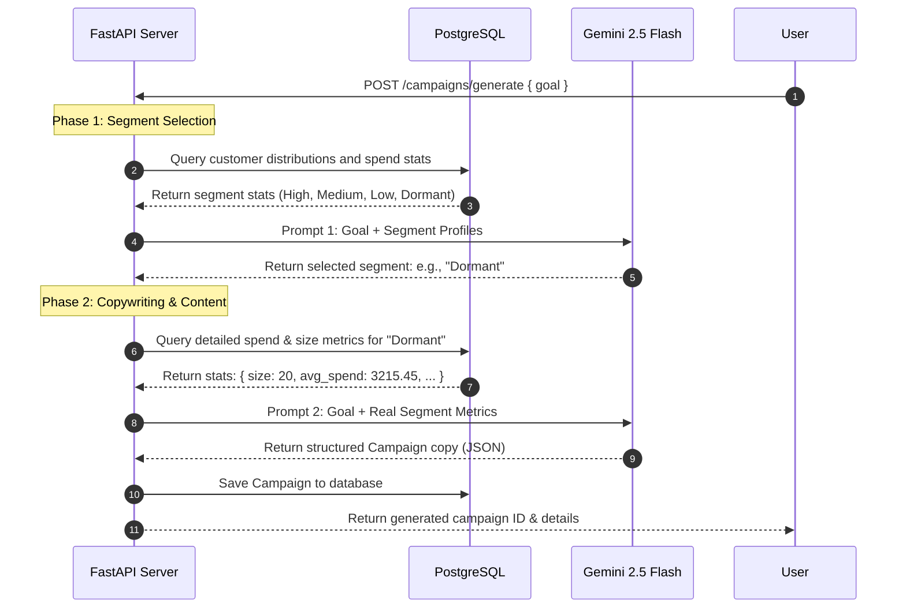

# Campaign Copilot - AI & Gemini Orchestration Workflow

This document details the generative AI engine integrated with Campaign Copilot, explaining the prompt engineering, Gemini API integration, and structured workflow stages.

---

## 1. Gemini Integration Overview
Campaign Copilot uses the official Google GenAI SDK (`google-genai`) to communicate with the `gemini-2.5-flash` model. 

Gemini is leveraged as a decision-making and content-generation agent. Rather than performing simple template-based copywriting, the system feeds live customer database statistics directly into the prompts, forcing the LLM to output context-aware marketing campaigns.

### Client Initialization
The client is initialized in [app/services/ai_service.py](file:///Users/tanmaydhiman/Desktop/CamPilot/app/services/ai_service.py):
```python
import os
from google import genai
from dotenv import load_dotenv

load_dotenv()

client = genai.Client(
    api_key=os.getenv("GEMINI_API_KEY")
)
```

---

## 2. Dynamic Segment & Campaign Selection Pipeline
Instead of asking the LLM to process thousands of customer records directly (which would be slow and cost-prohibitive), Campaign Copilot separates database operations from reasoning, executing a **two-phase decision pipeline**.

### Pipeline Sequence Diagram


---

## 3. Detailed Prompt Engineering & Templates

### Phase 1: Segment Selection
* **Function:** `choose_best_segment(goal, segment_stats)`
* **Purpose:** Analyzes the user's business objective and targets the most appropriate user tier.
* **Prompt Template:**
  ```
  You are a CRM strategist.

  Available customer segments:

  - High Value
  - Medium Value
  - Low Value
  - Dormant

  Business Goal:
  {goal}

  Choose the BEST segment.

  Return ONLY valid JSON.

  {{
      "segment_name": ""
  }}
  ```
* **Output Specification:** The model is constrained to return a single JSON object containing the `segment_name` corresponding to one of the four valid database categories.

---

### Phase 2: Copywriting & Strategy
* **Function:** `generate_campaign_content(goal, segment_stats)`
* **Purpose:** Craft the campaign name, communication channel, subject line, body text, and CTA.
* **Prompt Template:**
  ```
  You are a senior CRM marketing expert.

  Business Goal:
  {goal}

  Audience Data:
  {segment_stats}

  Generate a marketing campaign.

  Return ONLY valid JSON.

  {{
    "campaign_name": "",
    "subject_line": "",
    "message": "",
    "cta": "",
    "recommended_channel": ""
  }}
  ```
* **Output Specification:** The model is passed the exact size of the segment, its average spend, and average order counts. This enables the LLM to make intelligent adjustments:
  * For **High Value** segments, it might recommend WhatsApp/SMS with VIP styling and premium invitations.
  * For **Dormant** segments, it might suggest Email with discount codes based on their historical AOV.

---

## 4. Structured Output Sanitization
To prevent parsing errors caused by markdown formatting, the service filters code fences out of the text response before parsing:

```python
text = response.text
text = text.replace("```json", "")
text = text.replace("```", "")
parsed_json = json.loads(text.strip())
```
This ensures high reliability when converting unstructured model completions into database records.
