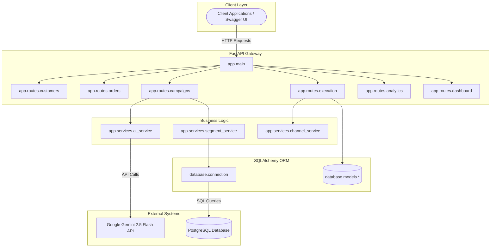
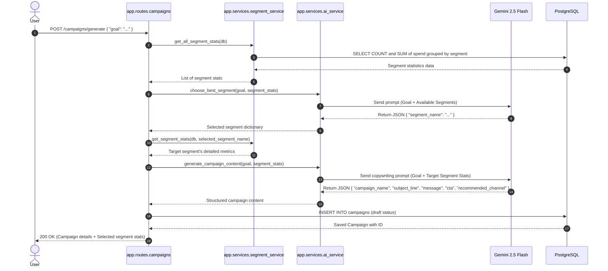
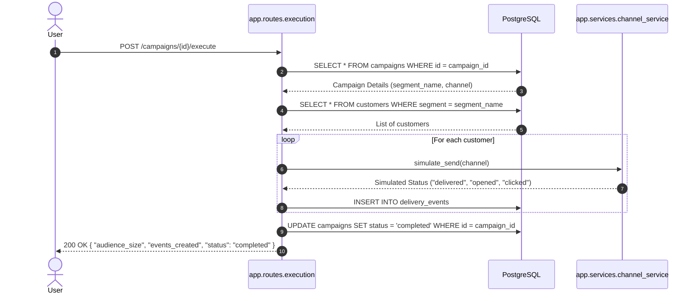
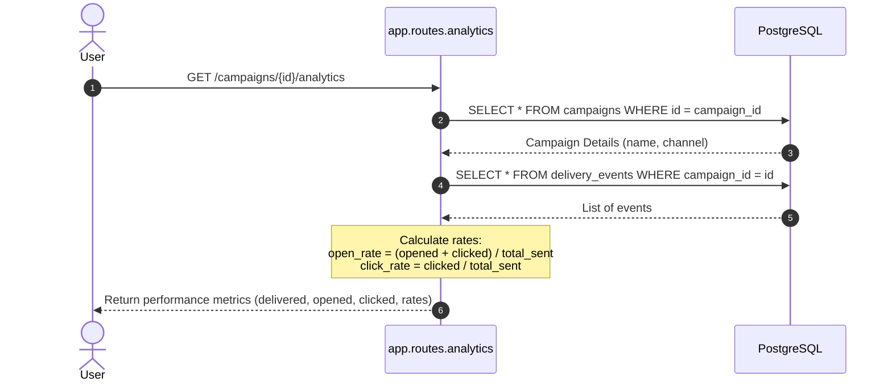

# Campaign Copilot - Technical Architecture

This document describes the high-level architecture, component designs, and operational data flows of Campaign Copilot.

---

## 1. High-Level Architecture
Campaign Copilot uses a standard clean, layered architecture separating routing, business services, database records, and LLM reasoning.

---

## 2. Component Descriptions

### A. API Routing Layer (`app/routes/`)
* **`customers.py` & `orders.py`**: Handle baseline CRM write and read requests. Validate request models using Pydantic schemas.
* **`metrics.py` & `segments.py`**: Calculate transactional KPIs (AOV, Recency, spend) and call AI services to review target cohorts.
* **`campaigns.py`**: The core AI orchestration controller. Coordinates between database segmentation queries and Gemini generative content requests.
* **`execution.py`**: Directs campaign dispatch simulations.
* **`analytics.py` & `dashboard.py`**: Read raw database data (spending records, delivery logs) and compute performance summaries.

### B. Business Logic Services (`app/services/`)
* **`segment_service.py`**: Encapsulates SQL-based aggregation queries. Generates statistical summaries (average spend, order frequencies, audience sizes) per customer segment.
* **`ai_service.py`**: The core AI adapter. Configured with the `google-genai` SDK and utilizes `gemini-2.5-flash` to structure system-level prompts, receive text, clean code fences, and parse JSON payloads.
* **`channel_service.py`**: Simple marketing dispatcher simulator. Simulates delivery results based on probabilities of users opening and clicking different communication channels (Email, SMS, WhatsApp).

### C. Database Access Layer (`database/`)
* **`connection.py`**: Sets up the SQLAlchemy database engine, connection pool, and `SessionLocal` generator context.
* **`models/`**: Implements declarative database tables: `Customer`, `Order`, `Campaign`, and `DeliveryEvent`.

---

## 3. Core Operational Flows

### A. AI-Driven Campaign Generation Flow
This flow describes what happens when a user requests a campaign generation from a high-level business goal.

---

## 4. Campaign Execution & Telemetry Simulation
When the marketer executes a campaign, the engine pulls the target audience, simulates marketing channel delivery, and commits telemetry back to the database.

---

## 5. Delivery Telemetry Analytics Flow
This flow aggregates the outcome of campaign execution to evaluate how well the AI copywriting performed.

