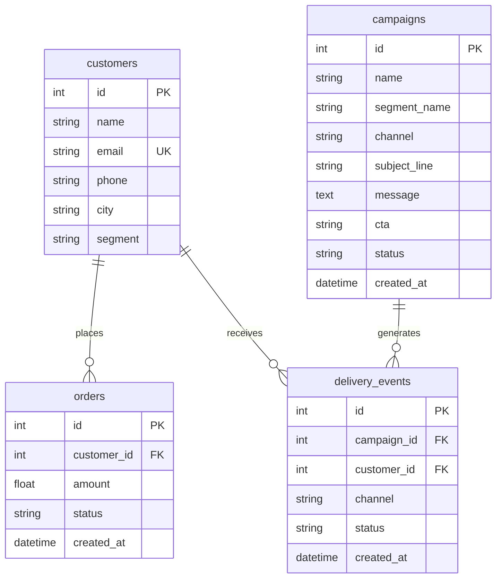

# Campaign Copilot - Database Schema & ER Reference

This document serves as the database reference manual for the Campaign Copilot CRM platform. The database runs on PostgreSQL and uses SQLAlchemy as the Object Relational Mapper.

---

## 1. Entity Relationship (ER) Diagram
The physical ER layout and relationships among the tables are defined below:

---

## 2. Table Schemas

### A. Table: `customers`
Stores demographic customer data and behavioral segments dynamically determined by historical transactions.

| Column | Type | Nullable | Constraints | Purpose |
|---|---|---|---|---|
| `id` | `Integer` | No | Primary Key, Auto-increment | Unique identifier for the customer. |
| `name` | `String` | No | None | Customer's full name. |
| `email` | `String` | No | Unique Index | Customer's email address (used for communication and unique identification). |
| `phone` | `String` | Yes | None | Customer's telephone number. |
| `city` | `String` | Yes | None | Customer's city (useful for geographical segmentation). |
| `segment` | `String` | Yes | None | Dynamically computed behavioral segment (e.g., `High Value`, `Medium Value`, `Low Value`, `Dormant`). |

**Relationships:**
* `orders`: One-to-many relationship with the `orders` table (cascading deletes, back-populated as `customer`).
* `delivery_events`: One-to-many relationship with the `delivery_events` table (back-populated as `customer`).

---

### B. Table: `orders`
Logs customer purchase transactions. Used to compute segment statistics.

| Column | Type | Nullable | Constraints | Purpose |
|---|---|---|---|---|
| `id` | `Integer` | No | Primary Key, Auto-increment | Unique identifier for the transaction. |
| `customer_id` | `Integer` | No | Foreign Key (`customers.id`) | Links the transaction to a specific customer profile. |
| `amount` | `Float` | No | None | Total monetary spend of the purchase order. |
| `status` | `String` | No | Default: `"completed"` | Status of the order (e.g., `"completed"`, `"pending"`, `"cancelled"`). |
| `created_at` | `DateTime` | No | Default: `func.now()` | Timestamp when the order was placed (critical for Recency metrics). |

**Relationships:**
* `customer`: Many-to-one relationship mapping back to the `customers` table.

---

### C. Table: `campaigns`
Stores AI-generated marketing campaign metadata and content copy.

| Column | Type | Nullable | Constraints | Purpose |
|---|---|---|---|---|
| `id` | `Integer` | No | Primary Key, Auto-increment | Unique campaign identifier. |
| `name` | `String` | No | None | Campaign name generated by the LLM. |
| `segment_name` | `String` | No | None | The target audience segment chosen for this campaign (e.g. `"Dormant"`). |
| `channel` | `String` | No | None | The distribution channel recommended by Gemini (e.g., `"Email"`, `"SMS"`, `"WhatsApp"`). |
| `subject_line` | `String` | Yes | None | The copywriting headline generated by the LLM (Email subject line). |
| `message` | `Text` | Yes | None | The main promotional copy text generated by the LLM. |
| `cta` | `String` | Yes | None | Call To Action text (e.g., `"Shop Now"`, `"Claim Discount"`). |
| `status` | `String` | No | Default: `"draft"` | Lifecycle state of the campaign (`"draft"`, `"completed"`). |
| `created_at` | `DateTime` | No | Default: `func.now()` | The date and time when the campaign was compiled. |

**Relationships:**
* `delivery_events`: One-to-many relationship mapping to simulated telemetry records.

---

### D. Table: `delivery_events`
Stores simulated dispatch results and user feedback loops (telemetry tracking).

| Column | Type | Nullable | Constraints | Purpose |
|---|---|---|---|---|
| `id` | `Integer` | No | Primary Key, Auto-increment | Unique event logging identifier. |
| `campaign_id` | `Integer` | Yes | Foreign Key (`campaigns.id`) | Maps the event back to the originating campaign definition. |
| `customer_id` | `Integer` | Yes | Foreign Key (`customers.id`) | Maps the event back to the recipient customer. |
| `channel` | `String` | Yes | None | The communication channel used (SMS, Email, WhatsApp). |
| `status` | `String` | Yes | None | Telemetry outcome (e.g., `"delivered"`, `"opened"`, `"clicked"`). |
| `created_at` | `DateTime` | No | Default: `func.now()` | Timestamp of simulated event dispatch. |

**Relationships:**
* `campaign`: Many-to-one relationship mapping to `campaigns` table.
* `customer`: Many-to-one relationship mapping to `customers` table.
