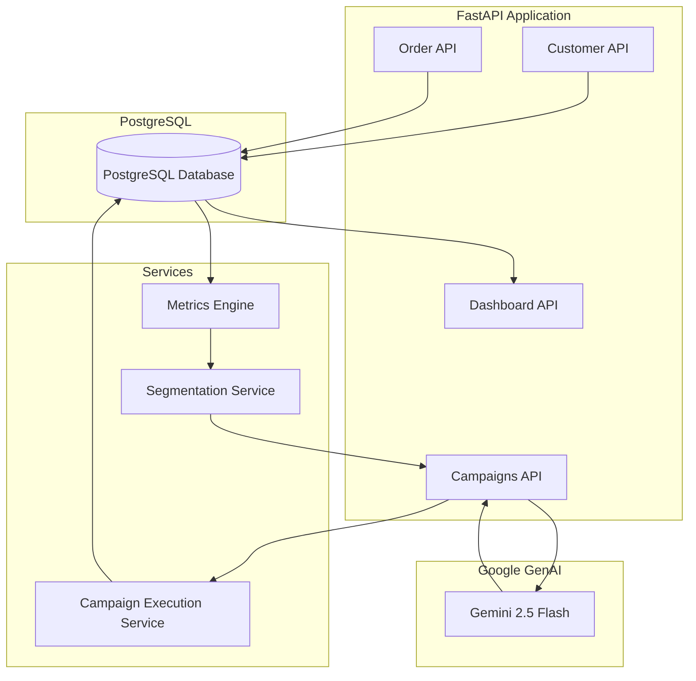

# Campaign Copilot - AI-Driven CRM & Campaign Execution Engine

[](https://www.python.org)
[](https://fastapi.tiangolo.com)
[](https://www.postgresql.org)
[](https://deepmind.google/technologies/gemini)

An advanced, AI-powered CRM orchestration and marketing automation platform built to help businesses dynamically segment customers, design tailored marketing campaigns using LLMs, execute delivery simulations, and track real-time analytics.

---

## 1. Problem Statement
Modern businesses generate massive amounts of customer transaction data but fail to activate it effectively. Marketing teams face significant hurdles:
* **Manual Segmentation:** Segmenting customers into categories (High Value, Medium Value, Dormant) is often done via rigid, manual, or slow query-based logic.
* **Disconnected Systems:** Analytics engines, CRM databases, and copy generation tools operate in silos, requiring marketing teams to copy-paste data back and forth.
* **Lack of Personalization:** Mass email/SMS campaigns are generic, resulting in low conversion, brand fatigue, and high unsubscribe rates.
* **No Closed-Loop Feedback:** It is difficult to tie specific generative AI content back to individual customer engagement metrics and conversion rates.

---

## 2. Solution Overview
**Campaign Copilot** is a closed-loop marketing engine that addresses these bottlenecks by integrating CRM databases directly with the Google Gemini LLM. 

The system reads customer spend, order history, and recency from PostgreSQL, aggregates behavioral metrics, identifies customer segments, and uses **Gemini 2.5 Flash** to automatically select the optimal audience segment and generate hyper-targeted marketing content (subject lines, copy, CTAs, and channels). The platform then simulates execution, tracks open and click delivery events, and pipes the feedback into a real-time analytics dashboard.

---

## 3. Key Features
1. **Customer Management API:** Core CRUD endpoints to manage customer profiles and metadata.
2. **Order Management API:** Tracks transaction records including order dates, amounts, and statuses.
3. **Customer Summary & Metrics API:** Aggregates transaction counts, total spending, Average Order Value (AOV), and days since the last purchase.
4. **Customer Segmentation Engine:** Classifies customers into distinct behavioral segments (High Value, Medium Value, Low Value, Dormant) using automated SQL transactions.
5. **AI-Powered Segment Selection:** Analyzes high-level business goals (e.g., "Win back churned users") and matches them with the segment most likely to convert.
6. **AI Campaign Generator:** Uses Gemini 2.5 Flash to automatically draft marketing copy (subject, message body, CTA, channel) customized to the segment's average spending and order habits.
7. **Campaign Execution Engine:** Automates sending campaigns to all users in the target segment, creating simulated delivery events.
8. **Delivery Event Tracking:** Logs event telemetry (delivered, opened, clicked) to build a closed-loop attribution model.
9. **Campaign Analytics API:** Computes total reach, open rates, and click-through rates (CTR) per campaign.
10. **Unified Executive Dashboard:** Provides high-level metrics including total revenue, customer segment distributions, and delivery metrics.

---

## 4. System Architecture
The platform follows a modular, layer-separated architecture comprising the Web API Layer (FastAPI), Database Access Layer (SQLAlchemy ORM + PostgreSQL), AI Integration Layer (Google GenAI Client), and Execution Simulation Services.



---

## 5. Tech Stack
* **Web Framework:** FastAPI (Asynchronous Python ASGI framework)
* **Database:** PostgreSQL (Relational database for storing customers, orders, campaigns, and delivery telemetry)
* **ORM:** SQLAlchemy (declarative base with PostgreSQL connection pooling)
* **AI Model:** Google Gemini 2.5 Flash (via `google-genai` SDK)
* **Data Seeding:** Faker (for generating realistic CRM data)
* **Environment Management:** Python dotenv & python-virtualenv

---

## 6. Project Structure
```
Campaign Copilot
├── app/
│   ├── dependencies.py          # Database session dependency injection
│   ├── main.py                  # API gateway and router registrations
│   ├── routes/
│   │   ├── analytics.py         # Customer summary and campaign analytics endpoints
│   │   ├── campaigns.py         # AI campaign generation logic and endpoint
│   │   ├── customers.py         # Customer management endpoints
│   │   ├── dashboard.py         # High-level aggregate KPIs
│   │   ├── execution.py         # Simulates execution and telemetry creation
│   │   ├── metrics.py           # Customer-level recency & spend calculation
│   │   ├── orders.py            # Order management endpoints
│   │   └── segments.py          # Segment strategy recommendation endpoint
│   │
│   ├── schemas/                 # Pydantic models for request/response validation
│   │   ├── campaign.py
│   │   ├── customer.py
│   │   ├── order.py
│   │   └── segment.py
│   │
│   └── services/                # Business logic & external service integrations
│       ├── ai_service.py        # Gemini client wrapper and structured prompts
│       ├── channel_service.py   # Delivery outcome simulator
│       └── segment_service.py   # SQL query builder for segment stats
│
├── database/
│   ├── connection.py            # Engine, SessionLocal, and declarative Base
│   ├── init_db.py               # Table creation entrypoint
│   └── models/                  # SQLAlchemy tables
│       ├── campaign.py
│       ├── customer.py
│       ├── delivery_event.py
│       └── order.py
│
├── scripts/
│   └── seed_data.py             # Generates mock profiles, orders, and segments
├── .env.example                 # Environment configuration template
├── README.md                    # Main documentation file
├── ARCHITECTURE.md              # Detailed architectural design
├── DATABASE.md                  # Database and ER schema reference
├── API_REFERENCE.md             # API endpoint documentation
├── AI_WORKFLOW.md               # Gemini prompt and LLM workflow reference
├── DEMO_GUIDE.md                # 5-minute walkthrough guide
└── FUTURE_ROADMAP.md            # Growth and scaling roadmap
```

---

## 7. Database Schema
The schema is designed to represent a classical CRM + Campaign platform:

* **`customers`:** Stores customer demographics, contact info, and their classified behavioral segment name.
* **`orders`:** Stores transactions, timestamps, and foreign keys mapping to customers.
* **`campaigns`:** Stores campaign definitions, selected channels, subject lines, message content, CTAs, and status.
* **`delivery_events`:** Stores communication logs, tracing delivery, open, and click states back to specific campaigns and customers.

Detailed entity relationships are documented in [DATABASE.md](file:///Users/tanmaydhiman/Desktop/CamPilot/DATABASE.md).

---

## 8. API Endpoints
A summary of the core endpoints exposed by the Campaign Copilot API is shown below. Complete request/response schemas can be found in [API_REFERENCE.md](file:///Users/tanmaydhiman/Desktop/CamPilot/API_REFERENCE.md).

| Method | Endpoint | Description |
|---|---|---|
| `POST` | `/customers` | Register a new customer in the database. |
| `POST` | `/orders` | Record a transaction/order for a customer. |
| `GET` | `/customers/{id}/summary` | Retrieve behavioral summaries (spending, orders, etc.). |
| `GET` | `/customers/{id}/metrics` | Retrieve detailed metrics (recency, frequency, AOV). |
| `POST` | `/campaigns/generate` | Trigger AI-driven segment selection and campaign generation. |
| `POST` | `/campaigns/{id}/execute` | Run campaign delivery simulation for all segment users. |
| `GET` | `/campaigns/{id}/analytics` | Retrieve campaign delivery performance (Open & Click rates). |
| `GET` | `/dashboard/summary` | Executive summary of CRM database and performance indicators. |

---

## 9. AI Workflow
Campaign Copilot activates customer segments in two AI-driven phases using the **Gemini 2.5 Flash** model:
1. **Segment Selection:** When a marketer enters a high-level business goal (e.g., `"Boost average order value during holiday season"`), the goal and high-level segment profiles are sent to Gemini. Gemini identifies the best segment (e.g., `"High Value"` or `"Medium Value"`) and provides reasoning.
2. **Context-Aware Campaign Copywriting:** The API retrieves actual CRM metrics (average spend, audience size, purchase frequency) for the selected segment. It feeds this raw data alongside the goal to Gemini to generate contextually aware campaign name, subject lines, copy, CTA, and recommends the best channel.

Detailed prompts and sequence flow diagrams are available in [AI_WORKFLOW.md](file:///Users/tanmaydhiman/Desktop/CamPilot/AI_WORKFLOW.md).

---

## 10. Setup Instructions

### Prerequisites
* Python 3.9+
* PostgreSQL running locally or in a Docker container
* Google Gemini API Key

### Installation

1. **Clone the Repository:**
   ```bash
   git clone https://github.com/tanmay2765/CamPilot.git
   cd CamPilot
   ```

2. **Create a Virtual Environment:**
   ```bash
   python3 -m venv venv
   source venv/bin/activate
   ```

3. **Install Dependencies:**
   ```bash
   pip install -r requirements.txt
   ```

4. **Initialize Database Tables:**
   Make sure PostgreSQL is running and you have created a database named `campaign_copilot`.
   ```bash
   python -m database.init_db
   ```

5. **Seed Database:**
   Generate 100+ customers, hundreds of transactional orders, and classify behavioral segments:
   ```bash
   python scripts/seed_data.py
   ```

---

## 11. Environment Variables
Create a `.env` file in the root directory and configure the following variables (refer to [.env.example](file:///Users/tanmaydhiman/Desktop/CamPilot/.env.example)):

```ini
DATABASE_URL=postgresql://<username>:<password>@localhost:5432/campaign_copilot
GEMINI_API_KEY=your_gemini_api_key_here
```

---

## 12. Running The Project
Start the FastAPI application locally using Uvicorn:

```bash
uvicorn app.main:app --reload
```
Once running, you can access the Interactive Swagger API docs at [http://127.0.0.1:8000/docs](http://127.0.0.1:8000/docs).

---

## 13. Example API Requests

### Generate Campaign
```bash
curl -X 'POST' \
  'http://127.0.0.1:8000/campaigns/generate' \
  -H 'accept: application/json' \
  -H 'Content-Type: application/json' \
  -d '{
  "goal": "Re-engage dormant customers who have not made a purchase recently"
}'
```

**Expected JSON Response:**
```json
{
  "campaign_id": 1,
  "selected_segment": {
    "segment_name": "Dormant"
  },
  "segment_stats": {
    "segment_name": "Dormant",
    "audience_size": 20,
    "average_spend": 3215.45,
    "average_orders": 9.5
  },
  "status": "draft",
  "campaign": {
    "campaign_name": "Dormant Customer Win-back Campaign",
    "subject_line": "We Miss You! Get 15% off your next purchase.",
    "message": "It's been a while since you last ordered. Here is a special discount to welcome you back!",
    "cta": "Shop Now",
    "recommended_channel": "Email"
  }
}
```

---

## 14. Future Improvements
* **Real SMS/Email Integrations:** Connect the campaign execution engine with Twilio, SendGrid, or AWS SES.
* **Closed-loop Purchase Tracking:** Automatically link clicks on CTAs to subsequent purchase orders to calculate the exact ROI of AI generated campaigns.
* **Multi-Channel Campaigns:** Allow campaigns to split audiences (e.g., 50% Email, 50% SMS) to perform A/B testing on copy.
* **Vector Embeddings for Similarity:** Use embeddings to identify customers with similar purchase patterns instead of relying on standard aggregate segmentation rules.

---

## 15. Conclusion
Campaign Copilot demonstrates how modern LLMs can be seamlessly coupled with transactional databases to automate CRM marketing operations. It replaces guess-work and slow segmentation flows with real-time, context-aware AI decision making, representing a highly performant and scalable design for modern enterprise campaigns.
